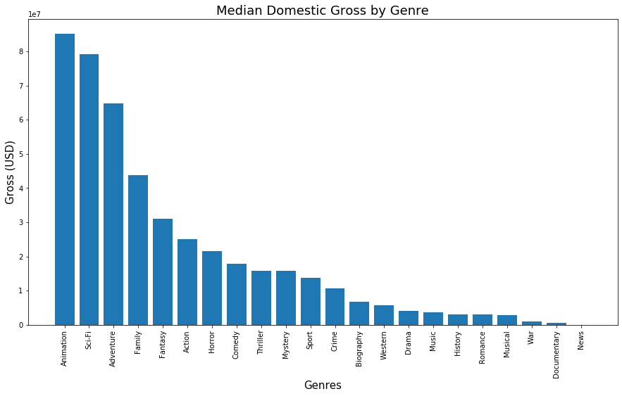
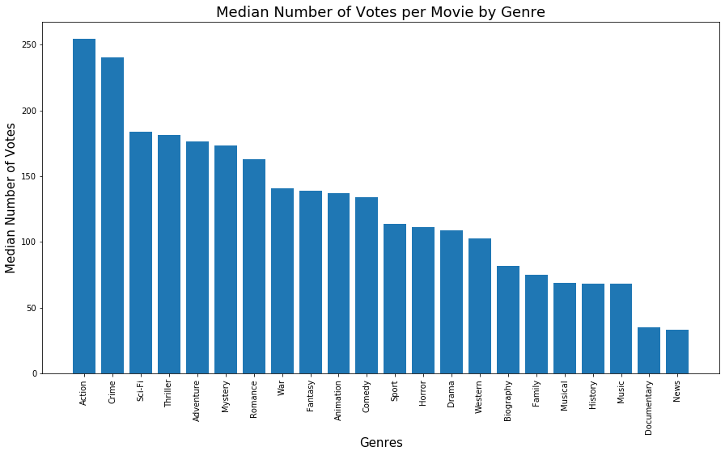
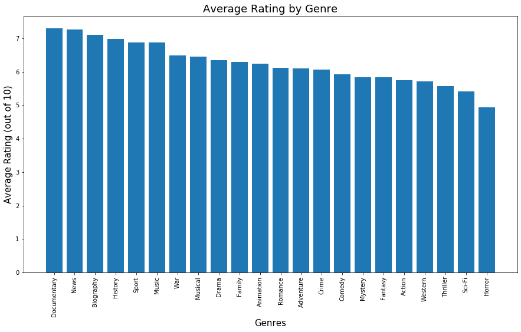
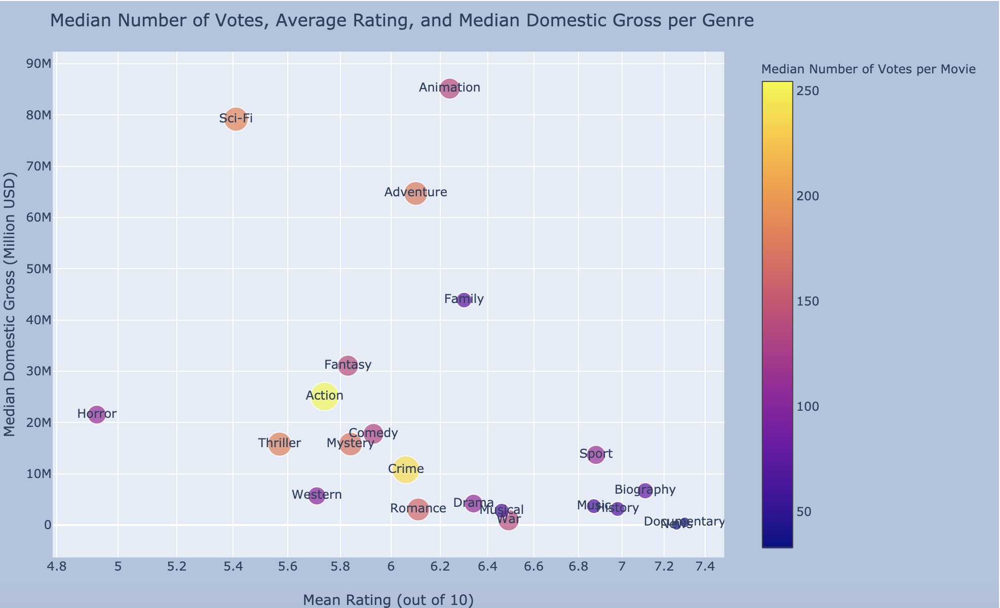

# Microsoft Movie Analysis


**Author**: [Jeremy Pagirsky](https://github.com/jeremypagirsky)

## Overview

This project analyzes various aspects of movie performance from [IMDB](https://www.imdb.com/) and [Box Office Mojo](https://www.boxofficemojo.com/). While the film industry often relies on income from the box office, many movie theaters are closed due to the COVID-19 pandemic. Therefore, these conditions stress the importance of consumer ratings in movie performance.

## Business Problem

Like its fellow competitors, Microsoft is seeking to begin creating original movies. They have opened up a new movie studio, but the company needs insight into which movies generally perform the best. "Success," in this analysis, is determined by domestic gross income, movie rating, and number of votes across each genre. Below are the questions that are the focus of this analysis:

1) Which genres generate the highest domestic gross?
2) Which genres have the highest ratings?
3) Which genres are the most popular?
***

## Data

Data on over 140,000 films from the years 2010–2019 was collected from [IMDB](https://www.imdb.com/) and [Box Office Mojo](https://www.boxofficemojo.com/). Movies in the original two IMDB datasets are assigned unique IDs while the Box Office Mojo dataset identifies movies by title, year, and genre. All data was supplied by Flatiron School.

## Methods

All datasets have been combined and cleaned for the main descriptive analysis. Microsoft's primary goal of film performance pertained to box office gross; the median domestic gross was collected. In addition, the current pandemic has highlighted usage of home-streaming apps. To elucidate viewers' contributions toward movie performance, mean rating and median number of votes are collected for each genre.

## Results

The highest grossing genres were Animation ($85.15M), Sci-Fi ($79.1M), and Adventure ($64.9M). 



The genres that received the greatest amount of votes per movie were Action (248), Crime (227), and Thriller (174.5). 


The highest rated genres were Documentary (7.3/10), News (7.26/10), and Biography (7.11/10).


## Conclusions

- **For when theaters reopen, create movies from higher grossing genres.** Animated movies that incorporate themes of Sci-Fi and Adventure, or vice-versa, are more likely to meet Microsoft's primary goal. These movies may also appeal to online gaming communities via Xbox Live.

- **Utilize home-streaming services to create movies that belong to popular genres.** Due to the COVID-19 pandemic, home-streaming services are currently the primary methods of film viewership. Movies belonging to more popular genres that blend higher-grossing genres may be a viable route to film success.

- **Create films that people tend to enjoy.** While they are less popular and tend to generate lower amounts of revenue, Documentary and News films tend to receive higher ratings than any other genre. These films, especially on a major streaming platform, may be viewed more often than in the box office.



## Future Work

Further analyses may consider the following for deeper insights into the film industry:

- **Incorporate additional factors that may influence data outcomes.** For example, one may gather data on why a person may be more willing to spend money on a movie in one genre compared to another.
- **Collect data from competing streaming services.** It may be useful to examine which factors are most correlated with movie success on platforms such as Netflix, Hulu, or Amazon.
- **Look at budget data for net income.** To gain more clarity on profits, it would be useful to understand which genres are more cost-effective.
-**Consider international markets.** It is important to build a foundation in domestic markets. In the future, international markets may provide rich opporunities for higher profits.


## For More Information

Please review the full analysis in [the Jupyter Notebook](Microsoft_Movie_Analysis.ipynb) or the [presentation](./dsc-phase-1-project-online/Microsoft_Movie_Analysis_Pres.pdf).

For any additional questions, please contact **Jeremy Pagirsky** at **jeremy.pagirsky@gmail.com**

## Repository Structure

```
├── Microsoft_Analysis_README.md          <- The README for reviewers of this project
├── Microsoft_Analysis.ipynb              <- Narrative documentation of analysis in Jupyter notebook
├── Microsoft_Movie_Analysis_Pres.pdf     <- PDF version of project presentation
├── /zippedData                           <- Both sourced externally and generated from code
└── images                                <- Generated from code
```
